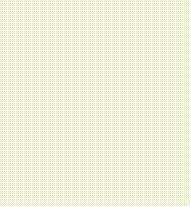

# Canvas Hand Draw
This is a utility to draw a set of points in an HTML5 Canvas, as if it was hand drawn by a human.

The need of having this component comes from an IA application, where a drawing is captured from a hand device (i.e. tablet or smartphone), and then the image is classified using a Neural Network. The points are captured to show the drawing to a human, who makes the initial classification to train the NN.

> The image can be later retrieved in raw to use it in your application.

The effect is shown in the next image:



## Including in your web page

### From a CDN

The easiest way to use _Canvas Hand Draw_ is to include it on your web page using a CDN:

```html
<script src="https://cdn.jsdelivr.net/gh/dealfonso/canvashanddraw@1/js/canvashanddraw.js"></script>
```

Please pay attention to the version that you want to use (in this example, it will use version 1)

### From your servers

While my advice is to use a CDN, it is possible to host _Canvas Hand Draw_ on your servers.

1. Get the code and generate the files to serve.

```console
$ git clone https://github.com/dealfonso/canvashanddraw.git
$ cd canvashanddraw
$ make
```

2. Copy the files to your web server and server them:

```console
$ cp canvashanddraw*.js /path/to/my/server
```

## Using

### Declarative method

The easiest method to use _Canvas Hand Draw_ is to include a `canvas` tag in an HTML document, with the class `canvashanddraw` and include the `.js` file, and use the attribute `data-points` to define the path to draw.

As an example, the next canvas...

```html
<div style="width: 200px; height: 200px">
<canvas class="canvashanddraw" id="21" data-points='[{"x":51.666656494140625,"y":128},{"x":52.666656494140625,"y":127.66665649414062},{"x":61.666656494140625,"y":121.66665649414062},{"x":90,"y":103.33332824707031},{"x":137,"y":75},{"x":181.3333282470703,"y":51},{"x":207.66665649414062,"y":38},{"x":219.3333282470703,"y":33.33332824707031},{"x":222.66665649414062,"y":32.33332824707031},{"x":223.3333282470703,"y":33},{"x":220.3333282470703,"y":39.666656494140625},{"x":209.66665649414062,"y":59},{"x":190.3333282470703,"y":91.33332824707031},{"x":165.66665649414062,"y":130.3333282470703},{"x":143.66665649414062,"y":165.66665649414062},{"x":129.3333282470703,"y":188.66665649414062},{"x":122,"y":202.3333282470703},{"x":119.33332824707031,"y":208.3333282470703},{"x":118.66665649414062,"y":210},{"x":118.66665649414062,"y":210.66665649414062},{"x":118.66665649414062,"y":210.3333282470703},{"x":119.33332824707031,"y":210},{"x":127.66665649414062,"y":207.66665649414062},{"x":145.66665649414062,"y":203},{"x":165,"y":198},{"x":180.66665649414062,"y":194.66665649414062},{"x":191,"y":193.66665649414062},{"x":197,"y":193.3333282470703},{"x":199.66665649414062,"y":193.66665649414062},{"x":200.3333282470703,"y":196},{"x":196.3333282470703,"y":206.3333282470703},{"x":186,"y":225.3333282470703},{"x":170.3333282470703,"y":249.66665649414062},{"x":156,"y":271.3333282470703},{"x":148,"y":284.6666564941406},{"x":144.66665649414062,"y":291.3333282470703},{"x":144.3333282470703,"y":294},{"x":149.66665649414062,"y":294.3333282470703},{"x":163.66665649414062,"y":291.3333282470703},{"x":182,"y":286.6666564941406},{"x":198,"y":284},{"x":206.66665649414062,"y":283.3333282470703},{"x":209.66665649414062,"y":284.3333282470703},{"x":206.66665649414062,"y":291.3333282470703},{"x":198,"y":306},{"x":189,"y":320.3333282470703},{"x":182.66665649414062,"y":331},{"x":179.3333282470703,"y":338},{"x":177.66665649414062,"y":341.6666564941406},{"x":176.66665649414062,"y":343},{"x":176.66665649414062,"y":343.3333282470703}]' width="100" height="100"></canvas>
</div>
```

will produce the next graph

.

Using the options, it is possible to draw with more quality and drawing dynamics, to get the next graph (using exactly the same points):

.

### Programmatically

If wanted to use the programmatical way, it is possible to get any canvas and create the `CanvasHandDraw` object and use the methods:

```javascript
let myCanvasObject = new CanvasHandDraw(document.getElementById('mycanvas'));

myCanvasObject.draw([{ "x": 2.1612899121945635, "y": 29.677419494076844 }, { "x": 2.1612899121945635, "y": 29.612904347039855 }, (...), { "x": 11.967742880837523, "y": 37.612903665505826 }]);
```
